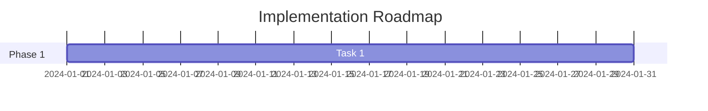

# Konsolidiertes Research Plan Template & Rules für KI-Agenten

## **Enhanced Research Plan Template**

### 📋 **Metadaten & Kontext**

```yaml
story_id: MPRJ-nnn
status: ACTIVE | IN_PROGRESS | BLOCKED | COMPLETED
priority: HIGH | MEDIUM | LOW
last_update: YYYY-MM-DD HH:MM
current_phase: [ Aktuelle Phase ]
next_milestone: [ Nächster wichtiger Meilenstein ]
```

### 🎯 **Analyseziel & Scope**

```markdown
## Primäres Analyseziel

[Klare Definition des Hauptziels]

## Scope Definition

- **In-Scope**: [Was wird analysiert]
- **Out-of-Scope**: [Was wird explizit nicht betrachtet]
- **Scope-Änderungen**: [Dokumentation von Anpassungen mit Zeitstempel]

## Erfolgskriterien

- [ ] Kriterium 1
- [ ] Kriterium 2
- [ ] Kriterium 3
```

### 🧠 **Living Knowledge Base**

```markdown
## Kernerkenntnisse

[Kontinuierlich aktualisierte Liste der wichtigsten Findings]

## Offene Fragen

- Q1: [Frage] | Status: [OPEN/ANSWERED] | Priority: [HIGH/MEDIUM/LOW]
- Q2: [Frage] | Status: [OPEN/ANSWERED] | Priority: [HIGH/MEDIUM/LOW]

## Hypothesen & Validierung

| Hypothese | Status | Evidenz | Confidence |
|-----------|--------|---------|------------|
| H1 | VALIDATED/REJECTED/PENDING | [Links] | 85% |

## Entscheidungslog

| Datum | Entscheidung | Begründung | Impact |
|-------|--------------|------------|--------|
```

### 🔄 **Dynamische Analysephasen**

#### **Phase 1: Discovery & Context Mapping**

```markdown
## Ziel

[Was soll in dieser Phase erreicht werden]

## Durchgeführte Aktivitäten

- [ ] Stakeholder-Analyse
- [ ] Systemlandschaft dokumentiert
- [ ] Abhängigkeiten identifiziert

## Erkenntnisse

[Detaillierte Findings mit Evidenz]

## Artefakte

- [x] Context-Diagramm: @/diagrams/context-MPRJ-nnn.mermaid
- [ ] Stakeholder-Matrix: @/docs/stakeholder-MPRJ-nnn.md
```

#### **Phase 2: Deep-Dive Analyse**

```markdown
## Fokusbereich

[Aktueller Analysefokus basierend auf Discovery]

## Technische Analyse

### Code-Analyse

- Repository: [Link]
- Analysierte Komponenten: [Liste]
- Code-Metriken: [Complexity, Coverage, etc.]

### Architektur-Review

- [ ] Component-Diagramm erstellt
- [ ] Sequence-Diagramme für kritische Flows

## Fachliche Analyse

### Prozessanalyse

- Ist-Prozess: [Dokumentiert in Mermaid]
- Pain Points: [Liste mit Priorität]
- Optimierungspotenziale: [Quantifiziert]

## Erkenntnisse

[Strukturierte Findings mit Verweisen]
```

#### **Phase 3: Synthesis & Recommendations**

```markdown
## Gap-Analyse

| Kategorie | Ist-Zustand | Soll-Zustand | Gap | Priorität |
|-----------|-------------|--------------|-----|-----------|

## Lösungsoptionen

### Option A: [Name]

- **Beschreibung**: [Details]
- **Pros**: [Liste]
- **Cons**: [Liste]
- **Aufwand**: [T-Shirt Size]
- **Risiko**: [LOW/MEDIUM/HIGH]

## Empfehlung

[Begründete Empfehlung mit Evidenz]

## Roadmap


```

### 📊 **Artefakte & Visualisierungen**
```markdown
## Erstellte Diagramme
- [ ] System Context: @/diagrams/system-context-MPRJ-nnn.mermaid
- [ ] Component Architecture: @/diagrams/components-MPRJ-nnn.mermaid
- [ ] Sequence Diagrams: @/diagrams/sequences-MPRJ-nnn.mermaid
- [ ] Process Flow: @/diagrams/process-MPRJ-nnn.bpmn

## Dokumentation
- [ ] Technical Analysis: @/docs/technical-analysis-MPRJ-nnn.md
- [ ] Business Impact: @/docs/business-impact-MPRJ-nnn.md
```